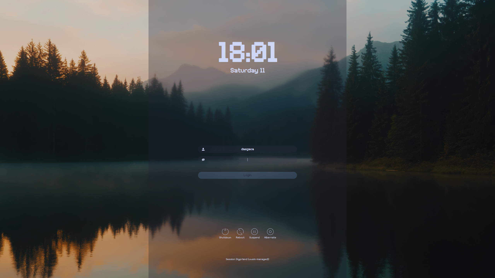
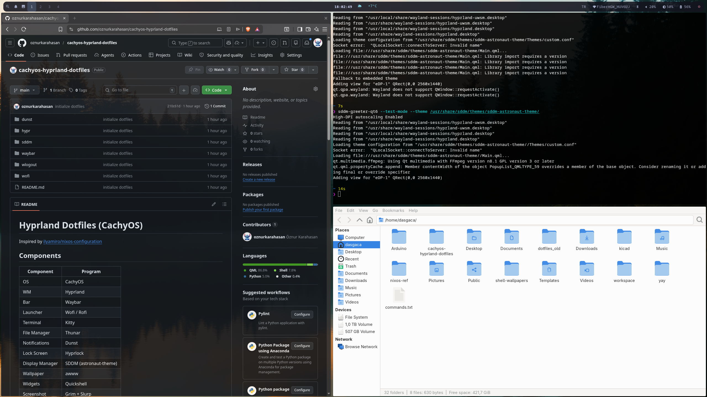
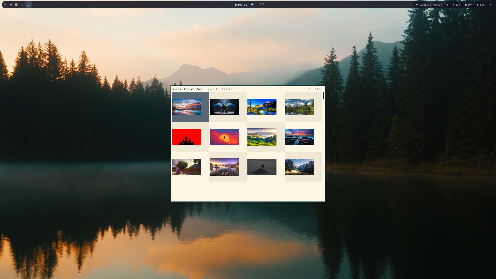
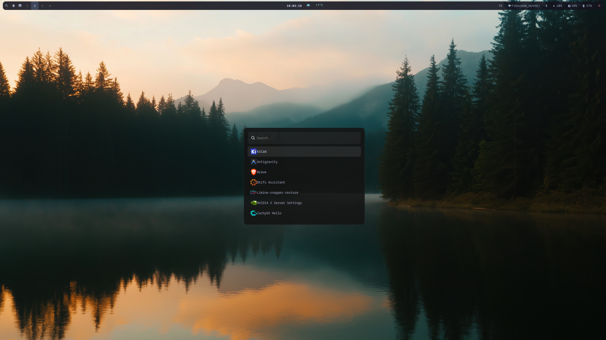
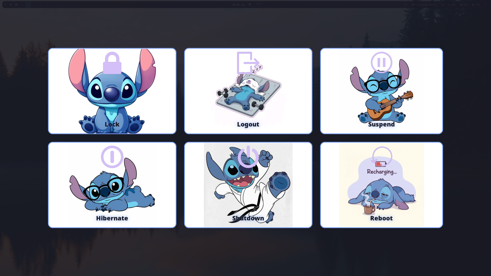

# Hyprland Dotfiles (CachyOS)

Inspired by [ilyamiro/nixos-configuration](https://github.com/ilyamiro/nixos-configuration)

## Components

| Component | Program |
|---|---|
| OS | CachyOS |
| WM | Hyprland |
| Bar | Waybar |
| Launcher | Wofi / Rofi |
| Terminal | Kitty |
| File Manager | Thunar |
| Notifications | Dunst |
| Lock Screen | Hyprlock |
| Display Manager | SDDM (astronaut-theme) |
| Wallpaper | awww |
| Widgets | Quickshell |
| Screenshot | Grim + Slurp |
| Power Menu | Wlogout |

## Installation

### 1. Required Packages

```bash
sudo pacman -S hyprland waybar wofi kitty hyprpaper hypridle hyprlock \
  noto-fonts ttf-nerd-fonts-symbols dunst xdg-desktop-portal-hyprland \
  pipewire wireplumber qt5-wayland qt6-wayland polkit-gnome \
  grim slurp wl-clipboard cliphist satty brightnessctl \
  rofi-wayland thunar gvfs gvfs-smb tumbler mousepad \
  blueman pavucontrol playerctl samba avahi nss-mdns wsdd
```

### 2. AUR Packages

```bash
yay -S sddm-astronaut-theme quickshell-git awww wlogout
```

### 3. Copy Config Files

```bash
cp -r dotfiles/hypr ~/.config/
cp -r dotfiles/waybar ~/.config/
cp -r dotfiles/dunst ~/.config/
cp -r dotfiles/wofi ~/.config/
cp -r dotfiles/wlogout ~/.config/
cp -r dotfiles/rofi ~/.config/
```

### 4. Make Scripts Executable

```bash
chmod +x ~/.config/hypr/scripts/*.sh
chmod +x ~/.config/waybar/scripts/*.sh
```

### 5. SDDM Theme

```bash
sudo cp dotfiles/sddm/custom.conf /usr/share/sddm/themes/sddm-astronaut-theme/Themes/
sudo cp dotfiles/sddm/custom.jpeg /usr/share/sddm/themes/sddm-astronaut-theme/Backgrounds/
sudo cp dotfiles/sddm/metadata.desktop /usr/share/sddm/themes/sddm-astronaut-theme/
sudo mkdir -p /etc/sddm.conf.d
sudo cp dotfiles/sddm/theme.conf /etc/sddm.conf.d/
```

### 6. Enable Services

```bash
sudo systemctl enable --now sddm
sudo systemctl enable --now smb nmb avahi-daemon wsdd
systemctl --user enable --now pipewire pipewire-pulse wireplumber
```

### 7. Wallpaper

Set your own wallpaper path in hyprland.conf:

```bash
nano ~/.config/hypr/hyprland.conf
# exec-once = awww img /path/to/wallpaper.jpg
```

### 8. Quickshell Widgets

```bash
mkdir -p ~/.config/hypr/scripts
cp -r dotfiles/hypr/scripts/quickshell ~/.config/hypr/scripts/
quickshell -p ~/.config/hypr/scripts/quickshell/TopBar.qml &
quickshell -p ~/.config/hypr/scripts/quickshell/Main.qml &
```

## Important Notes

### Wlogout Icons
After copying the config files, update the icon paths in `~/.config/wlogout/style.css` to match your username:

```css
#lock { background-image: url("/usr/share/wlogout/icons/lock.png"), url("/home/YOUR_USERNAME/.config/wlogout/icons/lock.jpg"); }
#logout { background-image: url("/usr/share/wlogout/icons/logout.png"), url("/home/YOUR_USERNAME/.config/wlogout/icons/logout.jpg"); }
#suspend { background-image: url("/usr/share/wlogout/icons/suspend.png"), url("/home/YOUR_USERNAME/.config/wlogout/icons/suspend.jpg"); }
#hibernate { background-image: url("/usr/share/wlogout/icons/hibernate.png"), url("/home/YOUR_USERNAME/.config/wlogout/icons/hibernate2.jpg"); }
#shutdown { background-image: url("/usr/share/wlogout/icons/shutdown.png"), url("/home/YOUR_USERNAME/.config/wlogout/icons/shutdown.jpg"); }
#reboot { background-image: url("/usr/share/wlogout/icons/reboot.png"), url("/home/YOUR_USERNAME/.config/wlogout/icons/reboot.jpg"); }
```

### Wallpaper
Update the wallpaper path in `~/.config/hypr/hyprland.conf`:

```bash
exec-once = awww-daemon
exec-once = awww img /home/YOUR_USERNAME/path/to/wallpaper.jpg --transition-type fade --transition-duration 1
```

Also update the wallpaper path in `~/.config/hypr/hyprlock.conf`:

```bash
path = /home/YOUR_USERNAME/path/to/wallpaper.jpg
```

### Wallpaper Picker Script
Update the wallpaper directory in `~/.config/waybar/scripts/wallpaper-picker.sh`:

```bash
WALLPAPER_DIR="/home/YOUR_USERNAME/path/to/wallpapers"
```

Replace `YOUR_USERNAME` with your actual username.

## Keybindings

| Keybind | Action |
|---|---|
| SUPER + Q | Terminal (Kitty) |
| SUPER + R | App Launcher (Wofi) |
| SUPER + E | File Manager (Thunar) |
| SUPER + L | Lock Screen |
| SUPER + W | Wallpaper Picker |
| SUPER + SHIFT + S | Screenshot |
| SUPER + SHIFT + E | Screenshot (Edit mode) |
| SUPER + Z | Clipboard History |
| SUPER + S | Calendar Widget |
| SUPER + N | Network Widget |
| SUPER + B | Battery Widget |
| SUPER + V | Volume Widget |
| SUPER + H | Guide Widget |
| SUPER + 1-9 | Switch Workspace |
| SUPER + SHIFT + 1-9 | Move Window to Workspace |

## Screenshots











